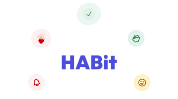
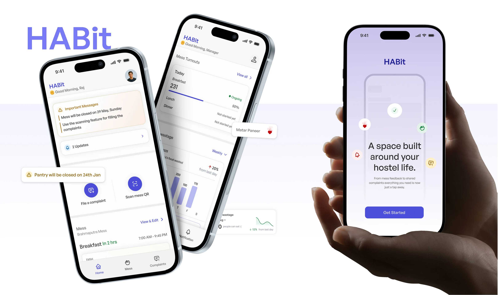
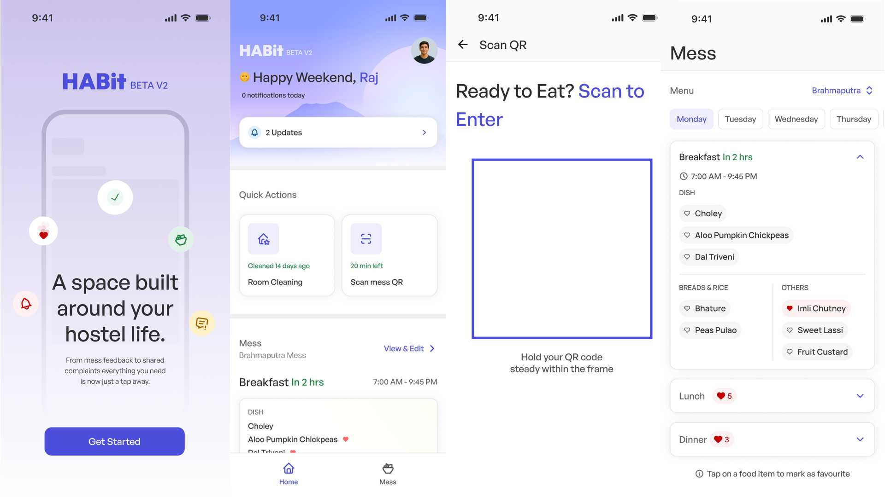
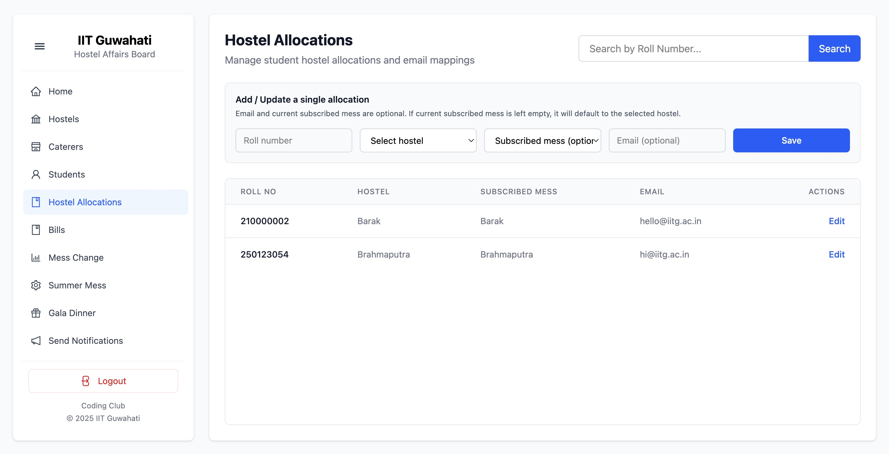
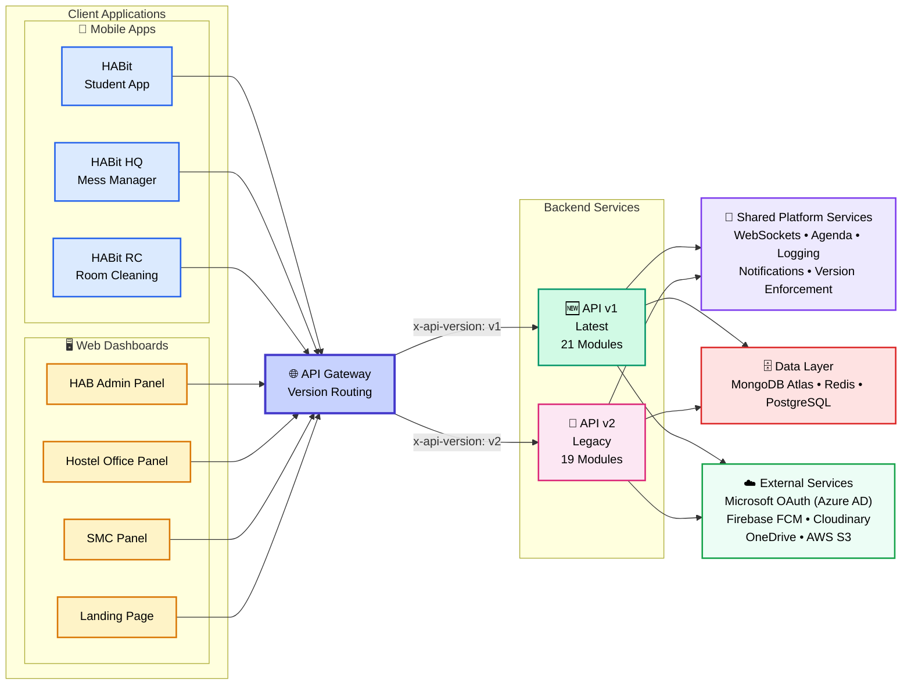

<div align="center">
   
</div>

<h1 align="center">HABit IITG</h1>

<p align="center">
   IIT Guwahati's unified campus-life platform
</p>

<div align="center"> 
   
</div>

<div align="center">
  <a href="https://play.google.com/store/apps/details?id=in.codingclub.hab"></a>
  <a href="https://apps.apple.com/us/app/habit-iitg/id6740746036"></a>
</div>

A unified ecosystem powering complaints, mess management, room cleaning, laundry services, gala dinners, leave requests, rebates, notifications, and administrative workflows across the entire IIT Guwahati hostel network.

Built collaboratively by the [Hostel Affairs Board (HAB)](https://hab.codingclub.in) and [Coding Club, IIT Guwahati](https://codingclub.in), the platform serves students, wardens, mess managers, hostel administrations, and governing bodies through a collection of mobile apps, web dashboards, and backend services.

## Features

- **Complaint management** with multi-stage approval workflows
- **QR-based mess authentication** and meal tracking
- **Mess change, rebate, and summer mess automation**
- **Room cleaning** scheduling and workforce management
- **Laundry** registration and tracking
- **Gala Dinner** registrations and QR validation
- **Leave applications** and hostel service feedback
- **Real-time notifications** and live updates
- Dedicated dashboards for HAB, SMC, wardens, caterers, and administrators

## Screenshots

<div align="center">Mobile App screens</div>


<div align="center">HAB Dashboard panel</div>


## System Architecture



<p align="center">
    
    
    
    
    
    
    
    
    
    
    
    
</p>

HABit follows a versioned service-oriented architecture designed to support multiple client applications while maintaining backward compatibility with legacy systems.

### Client Applications

The platform consists of seven frontend applications:

**Mobile Applications**: Built with Flutter 3.x + Dart.

- **HABit**: Student-facing application for hostel services and daily operations.
- **HABit HQ**: Mess management and dining operations.
- **HABit RC**: Room cleaning and maintenance workflows.

**Web Dashboards**: Built with React 19, Vite 6, Tailwind CSS 4, and Ant Design 5.

- **HAB Admin Panel**: Central administration and platform management.
- **Hostel Office Panel**: Hostel administration and resident management.
- **SMC Panel**: Student Mess Committee operations and oversight.
- **Landing Page**: Public-facing website and platform information.

### API Gateway

All client requests are routed through a centralized API Gateway built with Express 5. The gateway determines the appropriate backend service using the `x-api-version` header, allowing multiple API versions to coexist without impacting client applications.

### Backend Services

The backend currently maintains two Node.js 18+ / Express 5 API versions:

- **API v1**: The latest actively developed backend containing new features and improvements.
- **API v2**: Legacy backend retained for backward compatibility with existing clients and workflows.

This versioned approach enables gradual migration of features while ensuring uninterrupted service availability.

### Data Layer

The platform uses a persistence model backed by three databases:

- **MongoDB Atlas** serves as the primary operational database.
- **Redis** provides caching and real-time Pub/Sub messaging.
- **PostgreSQL** powers background job scheduling and queue management.

### External Integrations

HABit integrates with several third-party services:

- **Microsoft OAuth (Azure AD)** for authentication and identity management.
- **Firebase Cloud Messaging (FCM)** for push notifications.
- **Cloudinary** for image storage and media processing.
- **OneDrive** and **AWS S3** for file storage and asset management.

## Setup

### Prerequisites

- Node.js 18+
- Flutter 3.x
- pnpm (for web frontends)
- MongoDB (replica set), Redis, PostgreSQL

### 1. Backend Server

The server must be running before any frontend can connect.

```bash
cd server
cp .env.example .env   # configure your environment variables
pnpm install
pnpm dev
```

> [!NOTE]
> See `server/README.md` for detailed setup instructions including PM2 production deployment, environment variables reference, and API versioning.

### 2. Login Portal (Landing Page)

The login portal must be set up before any web dashboard.

```bash
cd login-frontend
pnpm install && pnpm dev        # localhost:5172/
```

### 3. Web Dashboards

Once the server and login portal are running, set up the admin dashboards:

```bash
# HAB Admin Panel
cd hab-frontend
pnpm install && pnpm dev       # localhost:5173/hab/

# Hostel Office Panel
cd hostel-frontend
pnpm install && pnpm dev       # localhost:5174/hostel/

# SMC Panel
cd smc-frontend
pnpm install && pnpm dev       # localhost:5175/smc/
```

### 4. Mobile Apps (Flutter)

```bash
# Student App
cd frontend2
flutter pub get && flutter run

# Mess Manager App
cd mess_frontend
flutter pub get && flutter run

# Room Cleaning App
cd rc_frontend
flutter pub get && flutter run
```

> [!NOTE]
> See the individual READMEs for platform-specific build instructions and API endpoint configuration.

## Workflow & Deployment

We follow a specific branching strategy to ensure stability:

- **`dev` Branch**: This is the active development branch. **All code changes, features, and fixes must be committed here.** Please create Pull Requests (PRs) against the `dev` branch.
- **`prod` Branch**: This branch is strictly for **production server deployment**. It reflects the live state of the application.

> [!CAUTION]
> Do not commit directly to `prod`. Changes are merged from `dev` to `prod` only when ready for release.

---

## License

IIT Guwahati © 2026 Hostel Affairs Board
